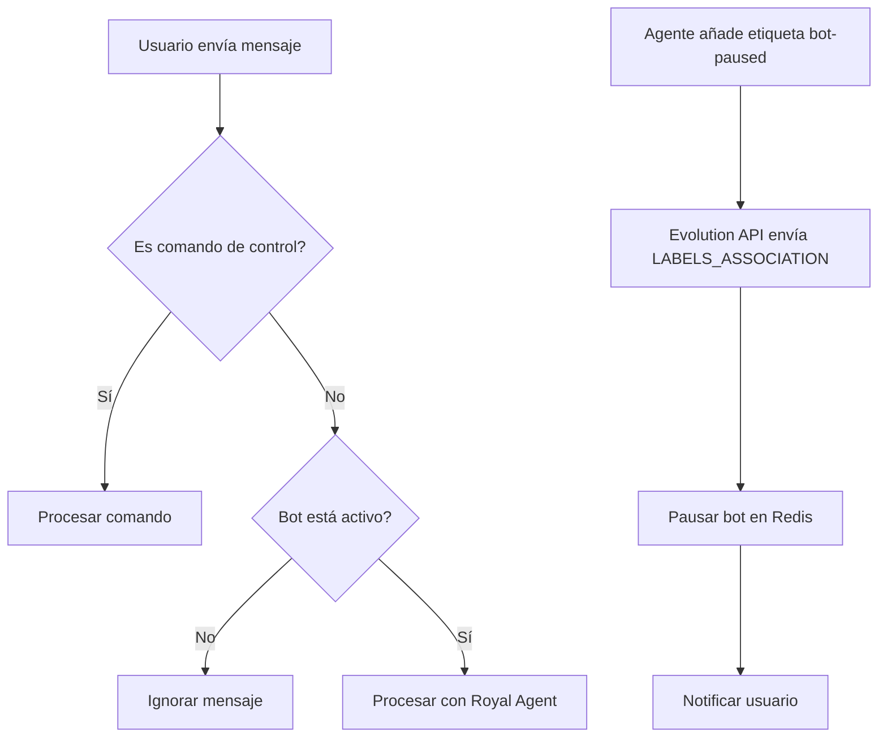

# 🤖 Sistema de Control de Estado del Bot

Sistema implementado para permitir pausar y reactivar el bot Royal desde Chatwoot usando Evolution API como puente.

## 📋 Configuración Requerida

### 1. Evolution API - Eventos del Webhook

Debes activar estos eventos en la configuración del webhook de Evolution API:

```
URL: https://tu-servidor.com/webhook/evolution
Eventos a activar:
- MESSAGES_UPSERT ✓ (ya activo - para mensajes)
- LABELS_ASSOCIATION ✓ (nuevo - para detectar etiquetas de Chatwoot)
```

### 2. Variables de Entorno

Asegúrate de tener configuradas estas variables:

```bash
REDIS_URL=redis://localhost:6379  # Para persistencia de estados
EVOLUTION_API_URL=https://tu-evolution-api.com
EVOLUTION_API_TOKEN=tu-token
INSTANCE_NAME=tu-instancia
```

## 🎯 Funcionalidades Implementadas

### 1. Control desde Chatwoot (Agente)

**Etiquetas de Control:**
- `bot-paused`: Pausa el bot para esa conversación
- Quitar `bot-paused`: Reactiva el bot

**Flujo de trabajo:**
1. Agente añade etiqueta `bot-paused` en Chatwoot
2. Evolution API envía evento `LABELS_ASSOCIATION`
3. Bot se pausa automáticamente
4. Usuario recibe notificación: "Un agente ha tomado control..."
5. Para reactivar: agente quita la etiqueta
6. Usuario recibe: "El asistente virtual está disponible..."

### 2. Control desde WhatsApp (Usuario)

**Comandos disponibles:**
- `/pausar` o `/stop`: Pausa el bot
- `/activar` o `/start`: Reactiva el bot  
- `/estado`: Muestra el estado actual

**Respuestas del sistema:**
- Al pausar: "🔴 Bot pausado. Envía /activar para reactivarlo..."
- Al activar: "🟢 Bot activado. ¡Listo para ayudarte!"
- Estado: "🟢 El bot está ACTIVO" o "🔴 El bot está PAUSADO"

### 3. API de Administración

**Endpoints disponibles:**

```bash
# Obtener estado de un usuario
GET /bot/status/{numero_telefono}

# Pausar bot para un usuario
POST /bot/pause/{numero_telefono}?reason=motivo&ttl=86400

# Reactivar bot para un usuario  
POST /bot/resume/{numero_telefono}

# Pausar todos los bots (mantenimiento)
POST /bot/pause-all?reason=maintenance

# Reactivar todos los bots
POST /bot/resume-all

# Estadísticas del sistema
GET /bot/stats
```

## 🔧 Características Técnicas

### Estados Persistentes
- **Redis**: Estados guardados con TTL de 24 horas
- **Claves**: `bot_state:{numero_telefono}`
- **Valores**: JSON con estado, razón, timestamp

### Auto-expiración
- Estados se eliminan automáticamente después de 24 horas
- TTL configurable por endpoint
- Fallback a "activo" si no hay Redis

### Tipos de Pausa
- `agent_control`: Pausado por agente desde Chatwoot
- `user_command`: Pausado por usuario desde WhatsApp
- `manual`: Pausado por API de administración
- `maintenance`: Mantenimiento del sistema

## 📱 Ejemplos de Uso

### Desde Chatwoot (Agente)
1. Abrir conversación del usuario
2. Añadir etiqueta `bot-paused`
3. El bot se pausa inmediatamente
4. Usuario recibe notificación automática
5. Para reactivar: quitar la etiqueta

### Desde WhatsApp (Usuario)
```
Usuario: /pausar
Bot: 🔴 Bot pausado. Envía /activar para reactivarlo...

Usuario: Hola, ¿cómo estás?
Bot: (no responde - está pausado)

Usuario: /activar  
Bot: 🟢 Bot activado. ¡Listo para ayudarte!

Usuario: /estado
Bot: 🟢 El bot está ACTIVO y listo para ayudarte.
```

### Desde API (Administrador)
```bash
# Pausar usuario específico
curl -X POST "https://tu-servidor.com/bot/pause/1234567890" \
  -d "reason=support&ttl=3600"

# Ver estado
curl "https://tu-servidor.com/bot/status/1234567890"

# Reactivar
curl -X POST "https://tu-servidor.com/bot/resume/1234567890"
```

## 🔍 Monitoreo y Logs

### Logs del Sistema
```
🔴 Bot pausado por agente para 1234567890
🟢 Bot reactivado por usuario 1234567890  
🏷️ Label event: add - Labels: ['bot-paused'] - Chat: 1234567890
ℹ️ Estado consultado por usuario 1234567890: paused
```

### Métricas
- `/bot/stats`: Estadísticas de bots pausados
- `/metrics`: Métricas generales del sistema
- Redis TTL automático evita "estados colgados"

## 🚨 Consideraciones Importantes

### 1. Dependencias
- **Evolution API** debe estar configurado correctamente
- **Redis** recomendado para persistencia (funciona sin él)
- **Chatwoot** debe enviar webhooks a Evolution API

### 2. Eventos de Evolution API
- `LABELS_ASSOCIATION` es crítico para control desde Chatwoot
- `MESSAGES_UPSERT` necesario para mensajes y comandos

### 3. Seguridad
- Estados expiran automáticamente (24h por defecto)
- Sin persistencia permanente de datos sensibles
- Comandos simples para usuarios

### 4. Escalabilidad
- Estados en Redis compartidos entre instancias
- TTL automático evita acumulación
- Sistema stateless (excepto por Redis)

## 🔄 Flujo de Eventos



## 📞 Soporte

Para problemas o preguntas:
1. Verificar logs del servidor
2. Comprobar configuración de Evolution API
3. Verificar conexión Redis
4. Revistar eventos configurados en webhook

Estado del sistema: `GET /bot/stats`  
Logs en tiempo real: `tail -f logs/royal_bot.log`