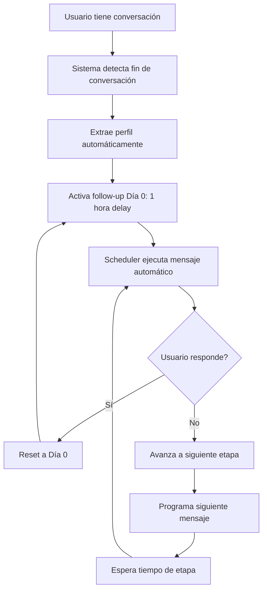

# 🚀 Sistema de Follow-up de 14 Etapas para Royal Bot

Sistema automático de seguimiento post-conversación que mantiene el engagement con usuarios potenciales a través de 14 etapas programadas durante 66+ días.

## 📋 Descripción del Sistema

El sistema de follow-up está diseñado para:
- **Convertir leads fríos en ventas** a través de seguimiento sistemático
- **Mantener engagement** con usuarios que mostraron interés inicial
- **Personalizar mensajes** según el perfil y comportamiento del usuario
- **Automatizar completamente** el proceso de nutrición de leads

## 🏗️ Arquitectura del Sistema

### Componentes Principales

1. **`follow_up_system.py`** - Gestión de base de datos y estados
2. **`follow_up_scheduler.py`** - Programador de tareas automáticas
3. **`follow_up_messages.py`** - Plantillas de mensajes personalizadas
4. **Integración en `royal_agent_contextual.py`** - Triggers automáticos
5. **Endpoints en `royal_server_optimized.py`** - API de gestión

### Base de Datos PostgreSQL

Tabla: `user_follow_ups`
```sql
- user_id (VARCHAR) - Identificador único del usuario
- current_stage (INTEGER) - Etapa actual (0, 1, 2, 4, 7, 10, 14, 18, 26, 36, 46, 56, 66, 999)
- last_interaction (TIMESTAMP) - Última interacción del usuario
- stage_start_time (TIMESTAMP) - Inicio de la etapa actual
- is_active (BOOLEAN) - Si el seguimiento está activo
- user_profile (JSONB) - Perfil personalizado del usuario
- interaction_count (INTEGER) - Número total de interacciones
- last_stage_completed (INTEGER) - Última etapa completada
```

## 📅 Cronograma de Seguimiento

### Secuencia de Etapas

| Etapa | Timing | Estrategia | Urgencia |
|-------|--------|------------|----------|
| **0** | 1 hora después | Primera reactivación | Media |
| **1** | Día 1 | Crear urgencia con casos de éxito | Alta |
| **2** | Día 2 | Testimonios y ROI | Alta |
| **4** | Día 4 | Presión temporal y oportunidades | Alta |
| **7** | Día 7 | Confrontación directa ("hablar vs actuar") | Alta |
| **10** | Día 10 | Comparación con otros usuarios exitosos | Media |
| **14** | Día 14 | Última oportunidad directa | Alta |
| **18** | Día 18 | Casos de éxito específicos | Media |
| **26** | Día 26 | Evaluación de situación | Baja |
| **36** | Día 36 | Reflexión sobre potencial perdido | Baja |
| **46** | Día 46 | Pregunta final sobre continuidad | Baja |
| **56** | Día 56 | Balance de 2 meses | Baja |
| **66** | Día 66 | Mensaje final de la serie | Baja |
| **999** | Cada 15 días | Modo mantenimiento | Baja |

### Reset Automático

**⚡ Funcionalidad Clave**: Cuando un usuario responde en cualquier momento, el sistema automáticamente:
1. Resetea al **Día 0** (1 hora de delay)
2. Incrementa el contador de interacciones
3. Actualiza el perfil con nueva información
4. Reinicia todo el cronograma

## 🎯 Personalización de Mensajes

### Factores de Personalización

1. **Tipo de Usuario**
   - `emprendedor` - Enfoque en emprendimiento
   - `revendedor` - Enfoque en reventa
   - `minorista` - Enfoque en compra personal

2. **Interés Principal**  
   - `joyas` - Productos de joyería
   - `maquillaje` - Productos de belleza
   - `indumentaria` - Ropa y accesorios
   - `general` - Mix de productos

3. **Nivel de Experiencia**
   - `empezando` - Primera vez emprendiendo
   - `intermedio` - Alguna experiencia
   - `experimentado` - Ya tiene negocio establecido

### Extracción Automática de Perfil

El sistema analiza automáticamente las conversaciones para extraer:
- Palabras clave de interés
- Nivel de experiencia mencionado
- Tipo de consultas realizadas
- Frecuencia de interacciones

## 🔧 Configuración e Instalación

### 1. Instalar Dependencias

```bash
pip install -r requirements_followup.txt
```

### 2. Variables de Entorno

```bash
# PostgreSQL
POSTGRES_HOST=localhost
POSTGRES_DB=royal_bot
POSTGRES_USER=postgres
POSTGRES_PASSWORD=your_password
POSTGRES_PORT=5432
```

### 3. Inicialización Automática

El sistema se inicializa automáticamente cuando se inicia `royal_server_optimized.py`.

La tabla de base de datos se crea automáticamente en el primer uso.

## 🛠️ API Endpoints

### Estadísticas del Sistema
```
GET /followup/stats
```
Retorna estadísticas del scheduler y usuarios activos.

### Usuarios Activos
```
GET /followup/users
```
Lista todos los usuarios en seguimiento activo.

### Estado de Usuario Específico
```
GET /followup/status/{user_id}
```
Obtiene el estado detallado de seguimiento de un usuario.

### Activación Manual
```
POST /followup/activate/{user_id}
```
Activa manualmente el seguimiento para un usuario.

### Desactivación Manual
```
POST /followup/deactivate/{user_id}
```
Desactiva el seguimiento para un usuario específico.

## 🧪 Testing

### Ejecutar Tests Completos
```bash
python test_followup_system.py
```

### Tests Incluidos
1. **Base de datos** - CRUD operations
2. **Plantillas** - Generación de mensajes
3. **Scheduler** - Programación de tareas
4. **Integración** - Comunicación entre componentes
5. **Endpoints** - API del servidor

## 📊 Monitoreo y Logs

### Logs Importantes
```
🚀 Follow-up activado para usuario: {user_id}
🔄 Usuario {user_id} respondió - Follow-up reseteado a Día 0
📤 Follow-up enviado a cola: {user_id} - Success: {success}
📈 Usuario {user_id} avanzado de etapa {old} a {new}
```

### Métricas del Sistema
- Usuarios activos en seguimiento
- Mensajes enviados por día/semana
- Tasa de respuesta por etapa
- Conversiones logradas

## 🔀 Flujo de Funcionamiento



## ⚙️ Configuración Avanzada

### Modificar Cronograma
Editar `FollowUpStage` enum en `follow_up_system.py`:
```python
class FollowUpStage(Enum):
    STAGE_0 = 0    # 1 hora después
    STAGE_1 = 1    # Día 1
    # ... agregar/modificar etapas
```

### Personalizar Mensajes
Editar plantillas en `follow_up_messages.py`:
```python
def _get_stage_X_templates(self) -> List[Dict[str, Any]]:
    return [
        {
            "message": "Tu mensaje personalizado...",
            "cta": "Call to action",
            "urgency": "high|medium|low"
        }
    ]
```

### Ajustar Callback de Envío
El sistema usa el callback configurado en `royal_server_optimized.py`:
```python
def send_followup_message(user_id: str, message: str) -> bool:
    # Tu lógica de envío personalizada
    return True
```

## 🚨 Consideraciones de Producción

### Performance
- El scheduler revisa usuarios cada 10 minutos
- Jobs de limpieza cada 6 horas
- Cache interno para evitar duplicados

### Escalabilidad
- Base de datos indexada para consultas rápidas
- Sistema de cola con prioridades
- Worker pool para procesamiento paralelo

### Monitoreo
- Logs detallados de todas las operaciones
- Estadísticas accesibles vía API
- Alertas automáticas en caso de errores

## 📞 Soporte

Para preguntas o problemas:
1. Revisar logs del sistema
2. Ejecutar `test_followup_system.py`
3. Verificar configuración de base de datos
4. Consultar documentación de componentes individuales

## 🎉 Casos de Uso Exitosos

### Escenario Típico
1. **Día 0**: Usuario consulta sobre emprendimiento
2. **1 hora después**: Recibe mensaje de seguimiento personalizado
3. **Si no responde**: Continúa secuencia automática
4. **Si responde**: Sistema resetea y reinicia desde Día 0
5. **Resultado**: Mayor engagement y conversiones

### Métricas Esperadas
- **30-40%** de usuarios responden en primeras 3 etapas
- **15-20%** continúan engagement hasta Día 14
- **5-10%** se mantienen activos en modo mantenimiento
- **Conversión general**: 2-5x mayor vs sin follow-up