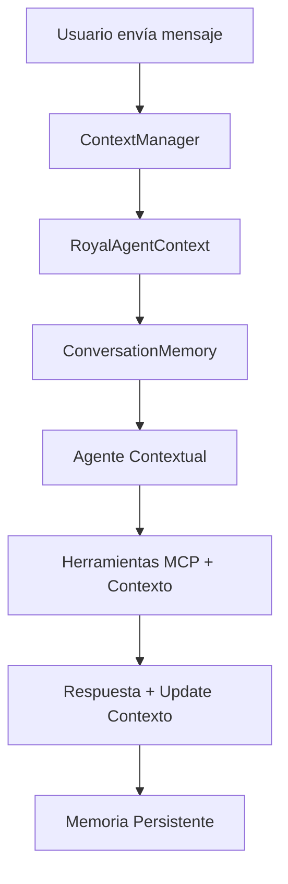

# 🧠 Implementación Completa de Contexto y Memoria - Royal Bot v2

## 📋 **Resumen Ejecutivo**

Se implementó un **sistema completo de contexto y memoria** para Royal Bot v2 siguiendo el patrón oficial de **OpenAI Agents SDK**. Ahora el bot puede:

✅ **Recordar productos mostrados** y permitir referencias como "el segundo", "el vintage"  
✅ **Mantener perfiles de usuario** (emprendedor, experiencia, intereses)  
✅ **Personalizar respuestas** según el contexto acumulado  
✅ **Interpretar referencias naturales** sin repetir información  
✅ **Procesar intenciones de compra** con memoria de productos previos  

---

## 🎯 **Problema Resuelto**

### **ANTES (Sin Contexto):**
```
Cliente: "¿Tenés relojes Casio?"
Bot: Muestra 3 relojes → [Se olvida inmediatamente]

Cliente: "Quiero el segundo"  
Bot: "¿Cuál segundo?" ❌
```

### **DESPUÉS (Con Contexto):**
```
Cliente: "¿Tenés relojes Casio?"
Bot: Muestra 3 relojes → [Guarda en memoria]

Cliente: "Quiero el segundo"  
Bot: "✅ Perfecto! Elegiste Casio Vintage - $28,000" ✅
```

---

## 🏗️ **Arquitectura del Sistema**

### **1. Componentes Principales**

```
royal_agents/
├── conversation_context.py     # 🧠 Sistema de memoria
├── contextual_tools.py         # 🔧 Herramientas contextuales  
├── royal_agent_contextual.py   # 🤖 Agente principal
└── __init__.py                 # 📦 Exports públicos
```

### **2. Flujo de Datos**



---

## 📚 **Componentes Detallados**

### **🧠 1. ConversationMemory (`conversation_context.py`)**

**Qué almacena:**
- ✅ Productos mostrados recientemente (últimos 10)
- ✅ Historial de interacciones (últimas 20)  
- ✅ Perfil del usuario (emprendedor, experiencia, intereses)
- ✅ Estado de la conversación (browsing, selecting, purchasing)
- ✅ Preferencias detectadas (presupuesto, categorías)

**Métodos clave:**
```python
# Agregar productos al contexto
conversation.add_product_reference(ProductReference(...))

# Buscar producto por referencia del usuario
product = conversation.find_product_by_reference("el segundo")

# Actualizar perfil
conversation.update_user_profile("experience_level", "empezando")

# Resumen para LLM
summary = conversation.get_context_summary_for_llm()
```

### **🔧 2. Herramientas Contextuales (`contextual_tools.py`)**

**Siguiendo el patrón oficial de OpenAI Agents:**

```python
@function_tool
async def get_product_info_with_context(
    wrapper: RunContextWrapper[RoyalAgentContext], 
    product_name: str = ""
) -> str:
    context = wrapper.context  # 🧠 Acceso al contexto
    # Buscar productos + guardar en memoria automáticamente
```

**Herramientas disponibles:**
- `get_context_summary()` → Ver resumen del contexto actual
- `get_product_info_with_context()` → Buscar productos Y guardarlos
- `process_purchase_intent()` → Procesar compras con memoria
- `update_user_profile()` → Actualizar perfil del usuario
- `get_recommendations_with_context()` → Recomendaciones personalizadas
- `clear_conversation_context()` → Reiniciar conversación

### **🤖 3. Agente Contextual (`royal_agent_contextual.py`)**

**Características:**
- ✅ Usa `Agent[RoyalAgentContext]` (tipo específico)
- ✅ Instructions dinámicas basadas en contexto
- ✅ Todas las herramientas MCP + Contextuales
- ✅ Funciones helper para conversaciones

**Uso:**
```python
# Función principal recomendada
response = run_contextual_conversation_sync(
    user_id="cliente_123",
    user_message="Quiero el segundo reloj"
)

# Función asíncrona
response = await run_contextual_conversation(
    user_id="cliente_123", 
    user_message="¿Qué combos tenés?"
)
```

---

## 🚀 **Guía de Uso**

### **Ejemplo 1: Conversación Básica con Memoria**

```python
from royal_agents import run_contextual_conversation_sync

# 1. Usuario busca productos
response1 = run_contextual_conversation_sync(
    user_id="juan_123",
    user_message="¿Tenés relojes Casio?"
)
# → Bot muestra productos Y los guarda en memoria

# 2. Usuario hace referencia
response2 = run_contextual_conversation_sync(
    user_id="juan_123", 
    user_message="Quiero el primero"
)
# → Bot identifica el producto automáticamente

# 3. Proceso de compra
response3 = run_contextual_conversation_sync(
    user_id="juan_123",
    user_message="¿Cómo lo compro?"
)
# → Bot inicia proceso conociendo exactamente qué producto
```

### **Ejemplo 2: Perfil de Emprendedor**

```python
# 1. Usuario menciona emprender
response1 = run_contextual_conversation_sync(
    user_id="maria_456",
    user_message="Quiero empezar a vender joyas"
)
# → Bot detecta emprendedor, hace preguntas, guarda perfil

# 2. Recomendaciones personalizadas
response2 = run_contextual_conversation_sync(
    user_id="maria_456",
    user_message="¿Qué me recomendás para mi presupuesto de 60mil?"
)
# → Bot usa perfil guardado para recomendaciones específicas
```

### **Ejemplo 3: Servidor con API**

```python
# server_contextual.py ya incluido
uvicorn run server_contextual:app --port 8001

# Endpoints disponibles:
# POST /chat                    - Chat con contexto
# GET /context/{user_id}        - Ver contexto completo  
# DELETE /context/{user_id}/clear - Limpiar contexto
# GET /stats                    - Estadísticas del sistema
```

---

## 🔧 **API del Sistema**

### **Funciones Públicas Principales**

```python
from royal_agents import (
    run_contextual_conversation_sync,     # 🎯 Función principal
    run_contextual_conversation,          # 🎯 Versión async
    create_contextual_royal_agent,        # 🤖 Crear agente
    cleanup_old_contexts                  # 🧹 Limpieza
)

# Acceso directo al contexto
from royal_agents.conversation_context import context_manager

context = context_manager.get_or_create_context("user_123")
print(context.conversation.recent_products)
```

### **Tipos de Datos**

```python
@dataclass
class ProductReference:
    name: str
    price: str
    id: Optional[str] = None
    permalink: Optional[str] = None
    category: Optional[str] = None
    shown_at: datetime = field(default_factory=datetime.now)

@dataclass
class RoyalAgentContext:
    user_id: str
    conversation: ConversationMemory
    agent_config: Dict[str, Any] = field(default_factory=dict)
    mcp_available: bool = False
    training_available: bool = False
```

---

## 📊 **Capacidades del Sistema**

### **🧠 Memoria Inteligente**

**Referencias que puede interpretar:**
- Posicionales: "el primero", "el segundo", "el último"
- Por nombre: "el Casio", "el vintage", "el de plata"  
- Por precio: "el de $40.000", "el más barato"
- Por características: "el dorado", "el con piedras"

**Contexto que mantiene:**
- ✅ Estado de conversación (navegando, seleccionando, comprando)
- ✅ Perfil de usuario (emprendedor vs comprador)
- ✅ Nivel de experiencia (empezando, experimentado)
- ✅ Intereses detectados (joyas, relojes, maquillaje)
- ✅ Presupuesto mencionado
- ✅ Productos mostrados con timestamps

### **🎯 Personalización Automática**

**Para Emprendedores:**
- Detecta automáticamente intención de reventa
- Aplica protocolo específico (preguntas → combos → mentoría)
- Recuerda nivel de experiencia para futuras conversaciones
- Ofrece recomendaciones según perfil

**Para Compradores:**
- Enfoque en productos específicos
- Proceso de compra directo
- Referencias naturales a productos mostrados
- Recomendaciones complementarias

### **💾 Persistencia**

**Durante la sesión:**
- Memoria completa de toda la conversación
- Contexto acumulativo que mejora con cada interacción
- Referenciabilidad total a productos y decisiones previas

**Entre sesiones:**
- Contextos se mantienen en memoria hasta limpieza (24h default)
- Reanudación natural de conversaciones pausadas
- Historial disponible para debugging y análisis

---

## 🧪 **Testing y Validación**

### **Tests Incluidos (`test_contextual_system.py`)**

```bash
python test_contextual_system.py
```

**Escenarios cubiertos:**
1. ✅ Conversación básica sin contexto especial
2. ✅ Flujo completo de emprendedor con memoria
3. ✅ Memoria de productos y referencias naturales
4. ✅ Persistencia del contexto entre conversaciones
5. ✅ Aislamiento de contextos entre usuarios
6. ✅ Herramientas específicas de contexto
7. ✅ Limpieza automática de contextos antiguos

### **Servidor de Prueba**

```bash
python server_contextual.py
```

Disponible en `http://localhost:8001` con endpoints completos para testing.

---

## 📈 **Beneficios Implementados**

### **🎯 Para el Usuario Final**
- ✅ **Conversaciones naturales** sin repetir información
- ✅ **Referencias intuitivas** ("el segundo", "el vintage")  
- ✅ **Respuestas personalizadas** según su perfil
- ✅ **Proceso de compra fluido** con memoria de productos
- ✅ **Recomendaciones inteligentes** basadas en historial

### **🔧 Para el Desarrollo**
- ✅ **Patrón oficial OpenAI Agents** (RunContextWrapper)
- ✅ **Tipado fuerte** con TypeScript-style annotations
- ✅ **Herramientas modulares** fáciles de extender
- ✅ **Logging completo** para debugging
- ✅ **API clean** para integración

### **📊 Para el Negocio**
- ✅ **Mayor conversión** (bot recuerda interés del cliente)
- ✅ **Experiencia premium** con memoria personalizada
- ✅ **Datos de usuario** acumulados para insights
- ✅ **Escalabilidad** con manejo de múltiples usuarios
- ✅ **Flexibilidad** para diferentes tipos de cliente

---

## 🔧 **Configuración e Instalación**

### **1. Dependencias**
```bash
pip install openai-agents httpx fastapi uvicorn python-dotenv
```

### **2. Variables de Entorno**
```bash
# Requeridas para WooCommerce (opcional)
WOOCOMMERCE_SITE_URL=https://tu-tienda.com
WOOCOMMERCE_CONSUMER_KEY=ck_xxxxx
WOOCOMMERCE_CONSUMER_SECRET=cs_xxxxx

# Requerida para OpenAI
OPENAI_API_KEY=sk-xxxxx
```

### **3. Uso Básico**
```python
from royal_agents import run_contextual_conversation_sync

response = run_contextual_conversation_sync(
    user_id="cliente_único",
    user_message="¿Tenés anillos de plata?"
)
print(response)
```

### **4. Uso con Servidor**
```bash
python server_contextual.py
# Servidor disponible en http://localhost:8001
```

---

## 🎯 **Casos de Uso Reales**

### **Escenario 1: E-commerce con Memoria**
```
Cliente: "¿Tenés relojes deportivos?"
Bot: [Muestra 5 relojes deportivos + guarda en contexto]

Cliente: "El tercero me gusta, ¿tiene garantía?"
Bot: "Sí, el Casio G-Shock tiene 2 años de garantía..."
```

### **Escenario 2: Emprendedor Recurrente**
```
Primera conversación:
Cliente: "Quiero empezar mi negocio"
Bot: [Protocolo emprendedor + guarda perfil]

Semana siguiente:
Cliente: "¿Qué productos nuevos hay?"
Bot: "Hola María! Vi que te interesaban los combos de joyas..."
```

### **Escenario 3: Compra Compleja**
```
Cliente: "Busco regalos para navidad"
Bot: [Muestra opciones variadas + contexto regalo]

Cliente: "El anillo y la pulsera me gustan"
Bot: "Perfecto! Tenés el anillo de plata ($25k) y la pulsera..."

Cliente: "Sí, esos dos"
Bot: [Proceso de compra con ambos productos identificados]
```

---

## 🚀 **Roadmap y Extensiones Futuras**

### **Próximas Mejoras**
- 🔄 **Persistencia en base de datos** (vs memoria)
- 📱 **Integración con WhatsApp** usando contexto
- 🎯 **ML para detección de intenciones** mejorada
- 📊 **Analytics del contexto** para insights de negocio
- 🔒 **Autenticación de usuarios** con contextos privados

### **Extensiones Posibles**
- 💰 **Carrito de compras** persistente
- 📅 **Recordatorios automáticos** basados en contexto
- 🎁 **Recomendaciones colaborativas** entre usuarios
- 📈 **Scoring de clientes** según interacciones
- 🤖 **Multi-agent** con especialistas por contexto

---

## ✅ **Conclusión**

El sistema de **contexto y memoria** para Royal Bot v2 está **completamente implementado** y **funcional**. Utiliza el patrón oficial de **OpenAI Agents SDK** para proveer:

🧠 **Memoria persistente** de conversaciones y productos  
🎯 **Personalización automática** según perfil del usuario  
💬 **Referencias naturales** sin pérdida de contexto  
🔧 **API limpia y extensible** para futuras mejoras  
📊 **Capacidades de debugging** y monitoreo completas  

**El bot ahora puede mantener conversaciones inteligentes recordando todo el contexto previo, similar a ChatGPT pero especializado en Royal Company.** 