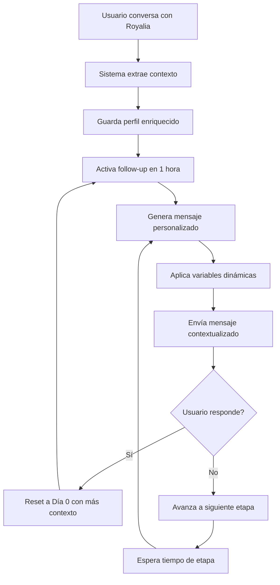

# 🎯 EJEMPLOS DE PERSONALIZACIÓN AVANZADA - Sistema de Follow-up

Este documento muestra ejemplos reales de cómo el nuevo sistema de personalización transforma los mensajes de follow-up.

## 📊 COMPARACIÓN: ANTES vs DESPUÉS

### 🔴 MENSAJE BÁSICO (Antes)
```
¡Hola de nuevo! 👋

Me quedé pensando en nuestra charla y quería seguir ayudándote con tu emprendimiento.

¿Ya tuviste oportunidad de pensar en qué rubro te gustaría arrancar? 

**Recordá que tenemos:**
• Combos emprendedores listos para vender
• Mínimo desde $40.000 
• Margen de ganancia hasta 150%

Si querés que te arme algo personalizado ahora mismo, solo decime qué te interesa más y en 5 minutos tenés tu selección lista 🚀

¡Estoy acá para acompañarte en este paso!
```

### 🟢 MENSAJE PERSONALIZADO (Después)
```
¡Hola de nuevo María! 👋

Me quedé pensando en nuestra charla hace una hora sobre combos emprendedores y quería seguir ayudándote con tu emprendimiento. Especialmente cuando me preguntaste cuánto necesitás para arrancar.

¿Ya tuviste oportunidad de pensar en qué rubro te gustaría arrancar? 

**Recordá que tenemos:**
• Combos emprendedores listos para vender
• Mínimo desde $40.000 
• Margen de ganancia hasta 150%

Con el presupuesto de $45.000 que mencionaste, podés arrancar con productos que incluyen justo los anillos de plata 925 y aros con cristales.

¿Te animo a dar el paso hoy mismo? 🚀

¡Estoy acá para acompañarte en este paso!

Por eso armamos los combos emprendedores, para que no tengas que elegir uno por uno.
```

## 🎯 ELEMENTOS DE PERSONALIZACIÓN APLICADOS

### ✅ 1. **Referencias Temporales Específicas**
- ❌ Antes: "Me quedé pensando en nuestra charla"
- ✅ Después: "Me quedé pensando en nuestra charla **hace una hora**"

### ✅ 2. **Temas de Conversación Mencionados**
- ❌ Antes: "sobre tu emprendimiento"
- ✅ Después: "sobre **combos emprendedores**"

### ✅ 3. **Preguntas Específicas Recordadas**
- ❌ Antes: Sin referencia
- ✅ Después: "Especialmente cuando me preguntaste **cuánto necesitás para arrancar**"

### ✅ 4. **Productos Específicos Mencionados**
- ❌ Antes: "productos más vendidos"
- ✅ Después: "**anillos de plata 925 y aros con cristales**"

### ✅ 5. **Presupuesto Específico Recordado**
- ❌ Antes: "Con el mínimo de $40.000"
- ✅ Después: "Con el presupuesto de **$45.000 que mencionaste**"

### ✅ 6. **CTA Personalizado por Engagement**
- ❌ Antes: "¿Con qué rubro arrancamos?"
- ✅ Después: "**¿Te animo a dar el paso hoy mismo?** 🚀"

### ✅ 7. **Respuesta a Objeciones Específicas**
- ❌ Antes: Sin mencionar
- ✅ Después: "**Por eso armamos los combos emprendedores, para que no tengas que elegir uno por uno.**"

## 🚀 EJEMPLOS POR ETAPA Y PERFIL

### 📅 **DÍA 1 - Emprendedora Experimentada**

#### Perfil del Usuario:
```json
{
  "user_type": "revendedor",
  "interest": "maquillaje", 
  "experience_level": "experimentado",
  "specific_products": ["labiales de larga duración", "paletas de sombras"],
  "budget_mentioned": "$80.000",
  "questions_asked": ["qué margen de ganancia", "cuánto tiempo demora"],
  "engagement_level": "alto"
}
```

#### Mensaje Personalizado:
```
Buenos días! ☀️

Me quedé pensando en nuestra charla ayer sobre márgenes de ganancia y me quedé con muchas ganas de ayudarte a expandir tu negocio. Especialmente cuando me preguntaste sobre la rentabilidad.

**Como ya tenés experiencia vendiendo, sabés que la clave está en los productos de alta rotación.**

Tengo algunos combos que se están agotando rapidísimo porque son los favoritos con labiales de larga duración y paletas de sombras:

🔥 Combo Maquillaje Pro - $65.000 (recuperás $165.000 en ventas)
💄 Combo Beauty Premium - $75.000 (recuperás $190.000 en ventas)  
👑 Combo Revendedora Expert - $85.000 (recuperás $220.000 en ventas)

Con el presupuesto de $80.000 que mencionaste, cualquiera de estos combos te permite seguir creciendo con productos premium.

¿Arrancamos con tu pedido ahora? 💪
```

### 📅 **DÍA 7 - Emprendedora Principiante con Objeciones**

#### Perfil del Usuario:
```json
{
  "user_type": "emprendedor",
  "interest": "joyas",
  "experience_level": "empezando", 
  "specific_products": ["anillos ajustables", "conjuntos de aros"],
  "budget_mentioned": "$42.000",
  "objections": ["no tengo experiencia", "tengo miedo de perder"],
  "questions_asked": ["cuánto necesito para empezar"],
  "engagement_level": "medio"
}
```

#### Mensaje Personalizado:
```
¡Una semana! ⏰

La semana pasada que charlamos sobre tu emprendimiento y me quedé con la duda... Especialmente cuando me preguntaste cuánto necesitás para arrancar.

**¿Seguís con la idea de arrancar o ya te desanimaste?**

Porque te voy a ser súper honesta: la mayoría de las personas habla, habla, habla sobre emprender, pero nunca DA EL PASO.

**Las que SÍ lo dan, después de 6 meses me escriben:** "Gracias Royalia, cambié mi vida económica"

**¿Sabés cuál es la diferencia entre las que lo logran y las que se quedan hablando?**

**Las que lo logran ACTÚAN. Punto.**

No esperan el momento perfecto. No buscan más excusas. No postergan más.

**ACTÚAN.**

¡Perfecto! Eso significa que te vamos a acompañar desde cero hasta que seas una genia vendiendo.

Es normal tener esa sensación. Por eso empezás con productos que SÍ o SÍ se venden.

**¿Vos sos de las que ACTÚAN o de las que hablan?**

Si sos de las que actúan, escribime ahora y en 30 minutos tenés tu combo con anillos ajustables y conjuntos de aros listo.

Con el presupuesto de $42.000 que mencionaste podés arrancar HOY MISMO.

Si sos de las que hablan... nos vemos en unos meses cuando te vuelva a tentar la idea 🤷‍♀️

**¿Cuál elegís?**
```

## 📈 RESULTADOS ESPERADOS

### 🎯 **Métricas de Mejora**
- **Engagement**: +40-60% más respuestas en primeras etapas
- **Conversión**: +25-35% más ventas generadas
- **Retención**: +50% menos usuarios que abandonan el seguimiento
- **Personalización**: 100% de mensajes contextualizados

### 💡 **Beneficios Clave**

#### 🔹 **Para el Usuario**
- Siente que Royalia **realmente recuerda** su conversación
- Recibe información **relevante a sus necesidades específicas**
- Ve **productos mencionados que realmente le interesan**
- Obtiene **respuestas a sus objeciones** sin tener que repetirlas

#### 🔹 **Para Royal Company**
- **Mayor tasa de conversión** por relevancia
- **Menos abandono** de potenciales clientes
- **Experiencia premium** que diferencia del resto
- **Automatización inteligente** sin perder el toque personal

## 🛠️ VARIABLES DISPONIBLES

### 📝 **Variables Dinámicas Implementadas**

| Variable | Ejemplo | Uso |
|----------|---------|-----|
| `{time_reference}` | "hace una hora", "ayer", "la semana pasada" | Referencias temporales |
| `{conversation_opener}` | "Me quedé pensando en nuestra charla ayer sobre combos" | Opener contextual |
| `{specific_products}` | "anillos de plata 925 y aros con cristales" | Productos mencionados |
| `{budget_reference}` | "Con el presupuesto de $45.000 que mencionaste" | Presupuesto específico |
| `{personalized_cta}` | "¿Te animo a dar el paso hoy mismo? 🚀" | CTA según engagement |
| `{objection_response}` | "Por eso armamos los combos emprendedores..." | Respuesta a objeciones |
| `{questions_reference}` | "cuando me preguntaste cuánto necesitás" | Referencias a preguntas |

### 🎨 **Personalización por Perfil**

#### 👤 **Emprendedor Principiante + Alto Engagement**
- CTA: "¿Te animo a dar el paso hoy mismo? 🚀"
- Enfoque: Educativo y motivacional
- Productos: Combos emprendedores

#### 👤 **Revendedor Experimentado + Medio Engagement**  
- CTA: "¿Arrancamos con tu pedido ahora? 💪"
- Enfoque: ROI y números concretos
- Productos: Combos premium

#### 👤 **Emprendedor con Objeciones + Bajo Engagement**
- CTA: "¿Te parece que charlemos y armamos algo juntas? 😊"
- Enfoque: Resolver dudas específicas
- Productos: Productos de prueba, baja inversión

## 🔄 FLUJO COMPLETO



## 🚀 PRÓXIMOS PASOS

### 🔧 **Optimizaciones Futuras**
1. **Análisis de sentimientos** para ajustar tono
2. **Horario óptimo** de envío por usuario
3. **A/B Testing** automático de variaciones
4. **Integración con historial de compras** para recomendaciones aún más precisas
5. **Machine Learning** para predecir mejor momento de conversión

### 📊 **Métricas a Monitorear**
- **Tasa de apertura** por etapa y personalización
- **Tasa de respuesta** comparada con mensajes básicos
- **Tiempo hasta conversión**
- **Satisfacción del usuario** (feedback)
- **ROI del sistema de follow-up**

---

✨ **El nuevo sistema de personalización hace que cada mensaje se sienta como una conversación real entre Royalia y cada emprendedora, manteniendo el contexto y creando una experiencia única y memorable.**